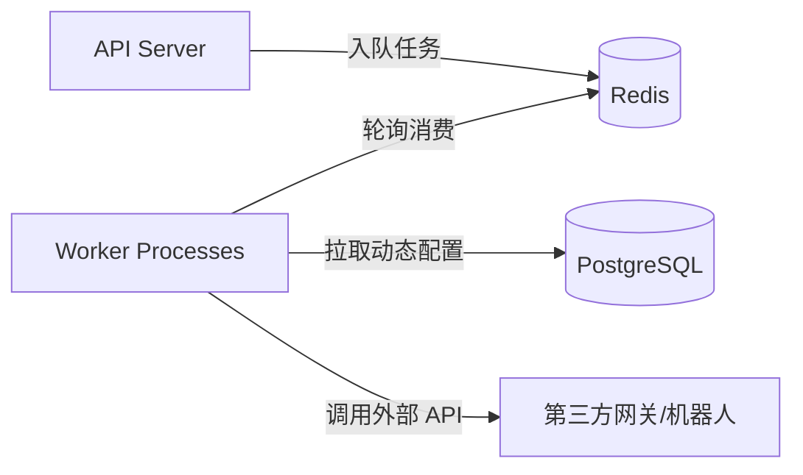

# Aetheris 使用与配置指南

Aetheris 是一款企业级高可用、高性能的聚合通知推送中心。它支持通过多种渠道（如站内信、邮件、短信、Webhook、Telegram 以及各大办公软件群机器人等）将通知发送给接收者。

通过前端管理后台的设置页面，各个租户可以动态修改每个通知渠道的配置并即时生效，无需重启服务。

## 快速上手

使用多租户 API Key 认证时，需要在 HTTP 请求的 Header 中添加以下任意一个字段：

- `Authorization: Bearer <你的API密钥>`
- `X-API-Key: <你的API密钥>`

**发送一条站内信通知示例：**

```bash
curl -X POST http://localhost:3000/api/send \
  -H 'Authorization: Bearer secret-a' \
  -H 'Content-Type: application/json' \
  -d '{
    "recipient": "user-1",
    "channel": "in_app",
    "title": "系统升级通知",
    "body": "Aetheris 服务已成功上线！"
  }'
```

## 渠道配置目录导航

- [1. In-App (站内信)](#1-in-app-站内信)
- [2. Email (SMTP 邮件)](#2-email-smtp-邮件)
- [3. SMS (通用 HTTP 短信)](#3-sms-通用-http-短信)
- [4. Webhook (外部通用 Webhook)](#4-webhook-外部通用-webhook)
- [5. Telegram (电报消息)](#5-telegram-电报消息)
- [6. Slack (Slack 群机器人)](#6-slack-slack-群机器人)
- [7. Discord (Discord 频道群机器人)](#7-discord-discord-频道群机器人)
- [8. Feishu (飞书/Lark 群机器人)](#8-feishu-飞书lark-群机器人)
- [9. DingTalk (钉钉群机器人)](#9-dingtalk-钉钉群机器人)
- [10. WeCom (企业微信群机器人)](#10-wecom-企业微信群机器人)

## 通知渠道配置

以下说明中，每个配置项对应的 JSON 格式均可以在后台“设置 -> 推送渠道”里点击卡片进行图形化修改。

### 1. In-App (站内信)

站内信默认由系统的数据库直接记录和提供查询，通常不需要任何额外参数。

- **配置 JSON**
  ```json
  {}
  ```

---

### 2. Email (SMTP 邮件)

通过标准的 SMTP 邮件服务商投递通知邮件。

- **配置项详解**
  | 配置项 | 类型 | 说明 | 获取途径 / 填写示例 |
  | :--- | :--- | :--- | :--- |
  | `host` | `string` | SMTP 服务器地址 | **必填**。从邮件服务商（如腾讯企业邮、阿里邮箱、网易 163、Gmail 等）后台获取。例如 `smtp.gmail.com` 或 `smtp.exmail.qq.com`。 |
  | `port` | `integer` | SMTP 服务端口 | **必填**。通常 STARTTLS 加密使用 `587`，SSL/TLS 加密使用 `465`，未加密使用 `25`。 |
  | `username` | `string` | 发信账户邮箱号 | **必填**。你的发信邮箱账号，如 `service@yourdomain.com`。 |
  | `password` | `string` | 账户密码 / 授权码 | **必填**。许多邮件服务商（例如 Gmail、网易）要求开启“客户端授权码”或“应用专用密码”，而非使用主账号密码。 |
  | `from` | `string` | 发件人头部名称 | **必填**。格式为 `显示名称 <邮箱地址>`，如 `Aetheris <noreply@yourdomain.com>`。必须与发信账户具有发信权限。 |
  | `tls_mode` | `string` | TLS 安全连接模式 | 可选值为 `starttls`（适用于 587 端口）、`tls`（适用于 465 端口）、`none`（不加密）。 |
  | `timeout_seconds` | `integer` | 连接超时秒数 | 默认 `10` 秒。超过此时间未建立连接则视作发送失败。 |
  | `headers` | `object` | 自定义邮件请求头 | 可选。用于设置过滤或优先级等属性的 JSON 对象，如 `{"X-Priority": "1"}`。 |

- **配置 JSON 示例**
  ```json
  {
    "host": "smtp.exmail.qq.com",
    "port": 465,
    "username": "noreply@yourdomain.com",
    "password": "your-smtp-app-password",
    "from": "Aetheris <noreply@yourdomain.com>",
    "tls_mode": "tls",
    "timeout_seconds": 10,
    "headers": {
      "X-Mailer": "Aetheris-Client"
    }
  }
  ```

---

### 3. SMS (通用 HTTP 短信)

支持对接任何第三方短信服务商提供的 HTTP/HTTPS API（如阿里云、腾讯云、Twilio、云片网等）。

- **配置项详解**
  | 配置项 | 类型 | 说明 | 获取途径 / 填写示例 |
  | :--- | :--- | :--- | :--- |
  | `url_template` | `string` | 短信服务商的 API 地址 | **必填**。服务商提供的接口地址。支持 Golang 变量渲染，如 `https://api.sms.com/send?mobile={{.Recipient}}`。 |
  | `method` | `string` | 请求方法 | 常用 `POST` 或 `GET`。根据短信商接口文档填写。 |
  | `headers` | `object` | HTTP 请求头 | 用于填入厂商的身份鉴权信息（如 API Key/Token）。格式为 JSON 键值对，如 `{"Authorization": "Bearer token"}`。 |
  | `body_template` | `string` | 请求 Body 结构模板 | 短信商要求提交的 Payload 模板。支持参数替换：`{{.Recipient}}` 替换为手机号，`{{.Body}}` 替换为短信正文。 |
  | `timeout_seconds` | `integer` | HTTP 请求超时秒数 | 默认 `10` 秒。 |
  | `success_status_min` | `integer` | 成功判断的 HTTP 最小状态码 | 默认 `200`。 |
  | `success_status_max` | `integer` | 成功判断的 HTTP 最大状态码 | 默认 `299`。如果状态码在此区间外，系统将判定发送失败。 |
  | `response_id_json_field`| `string` | 响应中回执 ID 的 JSON 字段 | 可选。例如服务商响应格式为 `{"msg_id": "123"}`，则填入 `msg_id`。 |

- **配置 JSON 示例**
  ```json
  {
    "url_template": "https://api.sms-vendor.com/v2/messages",
    "method": "POST",
    "headers": {
      "X-SMS-Secret": "your-api-secret-key",
      "Content-Type": "application/json"
    },
    "body_template": "{\"to\":\"{{ .Recipient }}\",\"text\":\"{{ quote .Body }}\"}",
    "timeout_seconds": 10,
    "success_status_min": 200,
    "success_status_max": 299,
    "response_id_json_field": "message_id"
  }
  ```

---

### 4. Webhook (外部通用 Webhook)

用于将事件通知实时推送回你的业务系统或其他集成平台。发送时将接收者 `recipient` 作为回调的实际目标 URL。

- **配置项详解**
  | 配置项 | 类型 | 说明 | 获取途径 / 填写示例 |
  | :--- | :--- | :--- | :--- |
  | `url_template` | `string` | Webhook URL 解析模板 | 默认设为 `{{ .Recipient }}`，以发送请求中的接收者字段作为推送目标。 |
  | `method` | `string` | 请求方法 | 默认 `POST`。 |
  | `headers` | `object` | 自定义 HTTP 请求头 | 可用于携带固定的鉴权 Token 或标志，如 `{"X-Webhook-Token": "secret"}`。 |
  | `body_template` | `string` | 自定义 Payload 结构模板 | 留空则默认发送 Aetheris 的标准 JSON payload。如果需要定制接收结构，可填入模板内容。 |
  | `timeout_seconds` | `integer` | 超时秒数 | 默认 `10` 秒。 |
  | `signing_secret` | `string` | 加密签名 Secret | 可选。填入任意字符串。如果设置，发送 Webhook 时将在 HTTP 头带上 `X-Aetheris-Signature: sha256=<HMAC签名值>`，接收方可用其校验数据是否被篡改。 |
  | `allowed_hosts` | `array` | 允许的域名白名单 | 限制 Webhook 只能向白名单内的域名发送请求。格式为字符串数组，如 `["*.yourdomain.com"]`。 |
  | `allow_private_ips` | `boolean` | 是否允许私网 IP | 默认 `false`。如果为 `true`，则允许向 `127.0.0.1` 等内网地址发 Webhook（本地测试时可用，线上务必关闭以避免 SSRF 安全隐患）。 |

- **配置 JSON 示例**
  ```json
  {
    "url_template": "{{ .Recipient }}",
    "method": "POST",
    "headers": {
      "Content-Type": "application/json"
    },
    "body_template": "",
    "timeout_seconds": 10,
    "success_status_min": 200,
    "success_status_max": 299,
    "allowed_hosts": ["*.internal.yourcompany.com"],
    "allow_private_ips": false,
    "signing_secret": "my-webhook-signing-token-xyz"
  }
  ```

---

### 5. Telegram (电报消息)

通过 Telegram Bot 发送消息给群组或个人用户。

- **配置项详解**
  | 配置项 | 类型 | 说明 | 获取途径 / 填写示例 |
  | :--- | :--- | :--- | :--- |
  | `bot_token` | `string` | Telegram 机器人密钥 | **必填**。打开 Telegram 应用，搜索官方小助手 `@BotFather`，发送 `/newbot` 指令创建一个新机器人即可获得此密钥。例如 `123456789:ABCdefGhIJKlm...`。 |
  | `api_base_url` | `string` | Telegram 服务端地址 | 默认 `https://api.telegram.org`。如果国内网络访问受限，可填入代理反代服务器。 |
  | `parse_mode` | `string` | 格式解析模式 | 可选 `HTML`、`Markdown` 或 `MarkdownV2`，控制消息正文是否加粗、换行或添加超链接。 |
  | `disable_link` | `boolean` | 是否禁用网页预览 | 设为 `true` 时，正文中的网址将不显示网页卡片预览。 |

- **配置 JSON 示例**
  ```json
  {
    "bot_token": "123456789:ABCdefGhIJKlmNoPQRsTUVwxyZ",
    "api_base_url": "https://api.telegram.org",
    "parse_mode": "HTML",
    "disable_link": true,
    "timeout_seconds": 10
  }
  ```
  > **注意**：发通知时，调用接口中的 `recipient` 应填入接收方的 `chat_id`（个人 ID 或群聊 ID）。群聊 ID 通常以 `-` 开头（如 `-10012345678`）。

---

### 6. Slack (Slack 群机器人)

向 Slack 的频道（Channel）内推送通知消息。

- **配置项详解**
  | 配置项 | 类型 | 说明 | 获取途径 / 填写示例 |
  | :--- | :--- | :--- | :--- |
  | `url_template` | `string` | Slack Incoming Webhook 链接 | **必填**。前往 Slack App 控制台，创建你的 App 并启用 `Incoming Webhooks`，将其绑定到工作区内的目标频道，生成此 Webhook 地址。格式如 `https://hooks.slack.com/services/...`。 |

- **配置 JSON 示例**
  ```json
  {
    "url_template": "https://hooks.slack.com/services/T000000/B000000/XXXXXXXXXXXXXXXX",
    "timeout_seconds": 10
  }
  ```

---

### 7. Discord (Discord 频道群机器人)

Discord 服务器中的消息推送助手。

- **配置项详解**
  | 配置项 | 类型 | 说明 | 获取途径 / 填写示例 |
  | :--- | :--- | :--- | :--- |
  | `url_template` | `string` | Discord 专属 Webhook 链接 | **必填**。进入 Discord 服务器的特定频道，点击“频道设置（齿轮图标） -> 整合 -> Webhook”，创建新 Webhook 并复制 URL。 |

- **配置 JSON 示例**
  ```json
  {
    "url_template": "https://discord.com/api/webhooks/1234567890/your-discord-token",
    "timeout_seconds": 10
  }
  ```

---

### 8. Feishu (飞书/Lark 群机器人)

将报警或业务变更通知推送到飞书群聊中。

- **配置项详解**
  | 配置项 | 类型 | 说明 | 获取途径 / 填写示例 |
  | :--- | :--- | :--- | :--- |
  | `url_template` | `string` | 飞书群助手 Webhook 链接 | **必填**。在飞书电脑端群设置中，选择“群助手 -> 添加机器人 -> 自定义机器人”，添加后即可获得该 Webhook 地址。 |

- **配置 JSON 示例**
  ```json
  {
    "url_template": "https://open.feishu.cn/open-apis/bot/v2/hook/xxxx-xxxx-xxxx-xxxx",
    "timeout_seconds": 10
  }
  ```

---

### 9. DingTalk (钉钉群机器人)

将系统监控、业务进度等通知推送到钉钉群聊。

- **配置项详解**
  | 配置项 | 类型 | 说明 | 获取途径 / 填写示例 |
  | :--- | :--- | :--- | :--- |
  | `url_template` | `string` | 钉钉群助手 Webhook 链接 | **必填**。进入钉钉群聊，依次选择“群设置 -> 智能群助手 -> 添加机器人 -> 自定义”，即可获取。可额外配置加签或自定义关键词。 |

- **配置 JSON 示例**
  ```json
  {
    "url_template": "https://oapi.dingtalk.com/robot/send?access_token=your-dingtalk-token",
    "timeout_seconds": 10
  }
  ```

---

### 10. WeCom (企业微信群机器人)

适合向企业内部研发群或项目管理群发送变更推送。

- **配置项详解**
  | 配置项 | 类型 | 说明 | 获取途径 / 填写示例 |
  | :--- | :--- | :--- | :--- |
  | `url_template` | `string` | 企业微信群机器人 Webhook 地址 | **必填**。在企业微信群聊头部右键选择“添加群机器人”，新建一个机器人，即可获取 Webhook URL。 |

- **配置 JSON 示例**
  ```json
  {
    "url_template": "https://qyapi.weixin.qq.com/cgi-bin/webhook/send?key=your-wecom-key",
    "timeout_seconds": 10
  }
  ```

---

## 📄 API 接口指南

主要核心接口，所有请求需要带租户 API Key。

### 1. 发送通知

- **接口**：`POST /send`
- **JSON 请求参数**：
  - `recipient` (string, 选填) - 接收人标识。如果在渠道中配置了“默认收件人”，此处可不填。
  - `channel` (string, 必填) - 渠道。可选：`in_app`, `email`, `sms`, `webhook`, `telegram`, `slack`, `discord`, `feishu`, `dingtalk`, `wecom`。
  - `title` (string, 可选) - 通知标题。
  - `body` (string, 可选) - 通知正文内容。
  - `template_key` (string, 可选) - 预设的模板 Key，若未传 title/body，服务端会自动渲染该模板。
  - `group_key` (string, 可选) - 聚合分组 Key，详见“高级”一章。
  - `idempotency_key` (string, 可选) - 唯一幂等键，防止因网络重试导致重复推送。
  - `metadata` (object, 可选) - 携带给渠道 Body 的自定义 JSON 键值对。

### 2. 标记站内信已读

- **接口**：`POST /in-app/messages/:id/read?user_id=user-123`
- 标记成功返回 `204 No Content`。

---

## 进阶

本章节涵盖了系统核心逻辑、性能调优和后端参数说明。

### 1. 技术架构总览

Aetheris 采用 Go (Gin) 编写 API 服务，支持 PostgreSQL/SQLite 作为业务主库，并可基于 Redis + Asynq 来提供高并发的后台任务分发。



### 2. 核心 `.env` 补充说明

除了基本运行地址外，在 `.env` 中你还可以微调以下两项与队列相关的性能指标：

- `ASYNQ_UNIQUE_TTL`：相同聚合键的通知在队列中的去重周期。在这个时效内，同一组的通知只会在队列中生成一条消费记录，这极大地减小了 Redis 读写压力。
- `WORKER_CONCURRENCY`：Worker 的并发协程数上限，过大可能导致三方频控限制，过小可能会产生消息积压。

### 3. 通知聚合 (Aggregation) 机制

当发送具有相同 `group_key` 的消息时，如果前一条消息还在队列中排队等待消费（处于 `queued` 状态），Aetheris 会触发**就地聚合**：

- 新的消息不会入队。
- 原有消息的 `AggregateCount` 自增（从 `1` 变为 `2`, `3` ...）。
- 新消息的 `title`、`body` 和 `metadata` 会覆盖并更新前一条消息。
- 在投递模版中，可以使用 `{{.AggregateCount}}` 获取当前的累计消息条数。例如：_"你收到了 {{.AggregateCount}} 条新的告警消息"_。

### 4. 外部 Webhook 安全性说明

Webhook 常常暴露于复杂的互联网环境中。为提高安全性，Aetheris 对 Webhook 做了双重加固：

1. **防止 SSRF**：内置了私网地址校验，默认不允许请求 `localhost`、`10.0.0.0/8`、`192.168.0.0/16` 等内网地址。如有本地调试需要，可动态配置 `allow_private_ips: true`。同时，`allowed_hosts` 可用于限定能够回调的域名范围。
2. **数据防篡改签名**：如果设置了 `signing_secret`，系统将使用该密钥对发送的 Body 执行 HMAC-SHA256 计算，并将结果放在请求头的 `X-Aetheris-Signature` 中。
   接收方验证 Go 伪代码如下：
   ```go
   mac := hmac.New(sha256.New, []byte(signingSecret))
   mac.Write(requestBody)
   expectedSignature := "sha256=" + hex.EncodeToString(mac.Sum(nil))
   if expectedSignature != r.Header.Get("X-Aetheris-Signature") {
       // 鉴权失败，丢弃请求
   }
   ```
