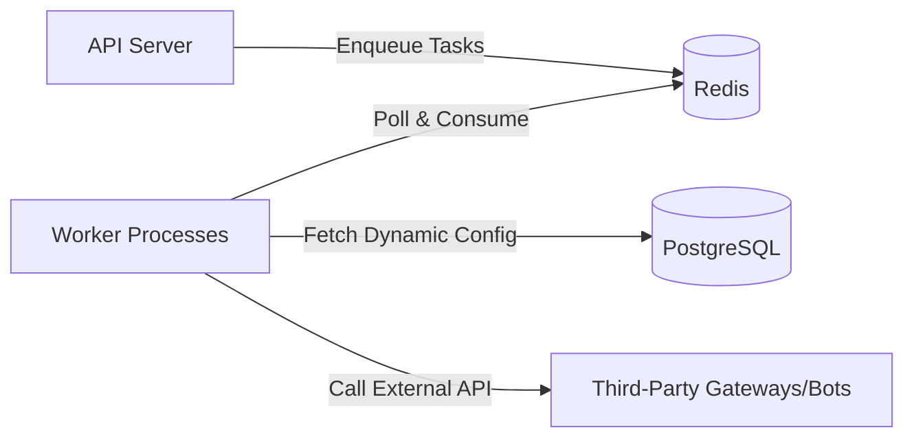

# Aetheris Setup & Configuration Guide

Aetheris is an enterprise-grade, high-availability aggregated notification hub. It delivers notifications across multiple channels — including in-app messages, email, SMS, webhooks, Telegram, and IM platform group bots.

All channel configurations can be updated dynamically via the management dashboard's Settings page and take effect immediately without restarting the service.

## Getting Started

For multi-tenant API Key authentication, include one of the following headers in your HTTP request:

- `Authorization: Bearer <your-api-key>`
- `X-API-Key: <your-api-key>`

**Sending an in-app notification:**

```bash
curl -X POST http://localhost:8080/send \
  -H 'Authorization: Bearer secret-a' \
  -H 'Content-Type: application/json' \
  -d '{
    "recipient": "user-1",
    "channel": "in_app",
    "title": "System Upgrade Notice",
    "body": "Aetheris service is now live!"
  }'
```

## Channel Configuration Index

- [1. In-App](#1-in-app)
- [2. Email (SMTP)](#2-email-smtp)
- [3. SMS (Generic HTTP SMS)](#3-sms-generic-http-sms)
- [4. Webhook (External Generic Webhook)](#4-webhook-external-generic-webhook)
- [5. Telegram](#5-telegram)
- [6. Slack](#6-slack)
- [7. Discord](#7-discord)
- [8. Feishu (Lark)](#8-feishu-lark)
- [9. DingTalk](#9-dingtalk)
- [10. WeCom (WeChat Work)](#10-wecom-wechat-work)

## Channel Configuration

Each channel's settings can be managed via the graphical UI under **Settings > Delivery Channels** in the dashboard.

### 1. In-App

In-app messages are stored and queried directly from the system database. No additional parameters are required.

- **Configuration JSON**
  ```json
  {}
  ```

---

### 2. Email (SMTP)

Deliver notification emails via standard SMTP providers.

- **Configuration Fields**
  | Field | Type | Description |
  | :--- | :--- | :--- |
  | `host` | `string` | **Required**. SMTP server address from your email provider (e.g. `smtp.gmail.com`, `smtp.exmail.qq.com`). |
  | `port` | `integer` | **Required**. Typically `587` for STARTTLS, `465` for SSL/TLS, or `25` for unencrypted. |
  | `username` | `string` | **Required**. Your sender email address, e.g. `service@yourdomain.com`. |
  | `password` | `string` | **Required**. The account password or app-specific authorization code (many providers require this instead of the main account password). |
  | `from` | `string` | **Required**. Format: `Display Name <email@address>`, e.g. `Aetheris <noreply@yourdomain.com>`. |
  | `tls_mode` | `string` | `starttls` (port 587), `tls` (port 465), or `none`. |
  | `timeout_seconds` | `integer` | Connection timeout in seconds. Default `10`. |
  | `headers` | `object` | Optional. Custom email headers as a JSON object, e.g. `{"X-Priority": "1"}`. |

- **Example Configuration**
  ```json
  {
    "host": "smtp.exmail.qq.com",
    "port": 465,
    "username": "noreply@yourdomain.com",
    "password": "your-smtp-app-password",
    "from": "Aetheris <noreply@yourdomain.com>",
    "tls_mode": "tls",
    "timeout_seconds": 10,
    "headers": {
      "X-Mailer": "Aetheris-Client"
    }
  }
  ```

---

### 3. SMS (Generic HTTP SMS)

Integrate with any third-party SMS provider's HTTP/HTTPS API (e.g. Twilio, Alibaba Cloud, Tencent Cloud).

- **Configuration Fields**
  | Field | Type | Description |
  | :--- | :--- | :--- |
  | `url_template` | `string` | **Required**. Provider's API endpoint. Supports Go template rendering, e.g. `https://api.sms.com/send?mobile={{.Recipient}}`. |
  | `method` | `string` | HTTP method, typically `POST` or `GET`. |
  | `headers` | `object` | HTTP headers for provider authentication (e.g. API Key/Token). |
  | `body_template` | `string` | Request body payload template. Supports `{{.Recipient}}` (phone number) and `{{.Body}}` (message text). |
  | `timeout_seconds` | `integer` | HTTP request timeout in seconds. Default `10`. |
  | `success_status_min` | `integer` | Minimum success HTTP status code. Default `200`. |
  | `success_status_max` | `integer` | Maximum success HTTP status code. Default `299`. |
  | `response_id_json_field`| `string` | Optional. JSON field path for the message receipt ID in the response, e.g. `msg_id`. |

- **Example Configuration**
  ```json
  {
    "url_template": "https://api.sms-vendor.com/v2/messages",
    "method": "POST",
    "headers": {
      "X-SMS-Secret": "your-api-secret-key",
      "Content-Type": "application/json"
    },
    "body_template": "{\"to\":\"{{ .Recipient }}\",\"text\":\"{{ quote .Body }}\"}",
    "timeout_seconds": 10,
    "success_status_min": 200,
    "success_status_max": 299,
    "response_id_json_field": "message_id"
  }
  ```

---

### 4. Webhook (External Generic Webhook)

Push event notifications back to your business system or integration platform. The `recipient` field in the send request is used as the actual callback URL.

- **Configuration Fields**
  | Field | Type | Description |
  | :--- | :--- | :--- |
  | `url_template` | `string` | Webhook URL template. Defaults to `{{ .Recipient }}` to use the send request's recipient as the target URL. |
  | `method` | `string` | HTTP method. Default `POST`. |
  | `headers` | `object` | Custom HTTP headers, e.g. `{"X-Webhook-Token": "secret"}`. |
  | `body_template` | `string` | Custom payload body template. Leave empty to send the standard Aetheris JSON payload. |
  | `timeout_seconds` | `integer` | Timeout in seconds. Default `10`. |
  | `signing_secret` | `string` | Optional. When set, sends an `X-Aetheris-Signature: sha256=<HMAC>` header for integrity verification on the receiving side. |
  | `allowed_hosts` | `array` | Domain allowlist restricting webhook targets, e.g. `["*.yourdomain.com"]`. |
  | `allow_private_ips` | `boolean` | Default `false`. When `true`, allows webhooks to private/internal IPs (useful for local testing; disable in production to prevent SSRF). |

- **Example Configuration**
  ```json
  {
    "url_template": "{{ .Recipient }}",
    "method": "POST",
    "headers": {
      "Content-Type": "application/json"
    },
    "body_template": "",
    "timeout_seconds": 10,
    "success_status_min": 200,
    "success_status_max": 299,
    "allowed_hosts": ["*.internal.yourcompany.com"],
    "allow_private_ips": false,
    "signing_secret": "my-webhook-signing-token-xyz"
  }
  ```

---

### 5. Telegram

Send messages to groups or individual users via a Telegram Bot.

- **Configuration Fields**
  | Field | Type | Description |
  | :--- | :--- | :--- |
  | `bot_token` | `string` | **Required**. Obtain from `@BotFather` on Telegram by creating a new bot with the `/newbot` command. |
  | `api_base_url` | `string` | Telegram API base URL. Default `https://api.telegram.org`. Set to a proxy/relay if direct access is restricted. |
  | `parse_mode` | `string` | Message parse mode: `HTML`, `Markdown`, or `MarkdownV2`. |
  | `disable_link` | `boolean` | When `true`, disables web page link previews in messages. |

- **Example Configuration**
  ```json
  {
    "bot_token": "123456789:ABCdefGhIJKlmNoPQRsTUVwxyZ",
    "api_base_url": "https://api.telegram.org",
    "parse_mode": "HTML",
    "disable_link": true,
    "timeout_seconds": 10
  }
  ```
  > **Note**: When sending, set `recipient` to the target's `chat_id` (individual or group). Group chat IDs typically start with `-` (e.g. `-10012345678`).

---

### 6. Slack

Push notification messages to Slack channels.

- **Configuration Fields**
  | Field | Type | Description |
  | :--- | :--- | :--- |
  | `url_template` | `string` | **Required**. Slack Incoming Webhook URL. Create a Slack App, enable `Incoming Webhooks`, and bind it to a target channel. Format: `https://hooks.slack.com/services/...`. |

- **Example Configuration**
  ```json
  {
    "url_template": "https://hooks.slack.com/services/T000000/B000000/XXXXXXXXXXXXXXXX",
    "timeout_seconds": 10
  }
  ```

---

### 7. Discord

Message push assistant for Discord servers.

- **Configuration Fields**
  | Field | Type | Description |
  | :--- | :--- | :--- |
  | `url_template` | `string` | **Required**. Discord Webhook URL. Go to channel settings > Integrations > Webhooks, create a new webhook, and copy the URL. |

- **Example Configuration**
  ```json
  {
    "url_template": "https://discord.com/api/webhooks/1234567890/your-discord-token",
    "timeout_seconds": 10
  }
  ```

---

### 8. Feishu (Lark)

Push alerts or business change notifications to Feishu group chats.

- **Configuration Fields**
  | Field | Type | Description |
  | :--- | :--- | :--- |
  | `url_template` | `string` | **Required**. Feishu group bot Webhook URL. In the Feishu desktop app, go to Group Settings > Bot > Add Custom Bot to obtain the URL. |

- **Example Configuration**
  ```json
  {
    "url_template": "https://open.feishu.cn/open-apis/bot/v2/hook/xxxx-xxxx-xxxx-xxxx",
    "timeout_seconds": 10
  }
  ```

---

### 9. DingTalk

Push system monitoring and business progress notifications to DingTalk group chats.

- **Configuration Fields**
  | Field | Type | Description |
  | :--- | :--- | :--- |
  | `url_template` | `string` | **Required**. DingTalk group bot Webhook URL. In DingTalk, go to Group Settings > Bot > Add Custom Bot. Supports additional signing or keyword config. |

- **Example Configuration**
  ```json
  {
    "url_template": "https://oapi.dingtalk.com/robot/send?access_token=your-dingtalk-token",
    "timeout_seconds": 10
  }
  ```

---

### 10. WeCom (WeChat Work)

Send change notifications to internal development or project management groups.

- **Configuration Fields**
  | Field | Type | Description |
  | :--- | :--- | :--- |
  | `url_template` | `string` | **Required**. WeCom group bot Webhook URL. Right-click a WeCom group chat header, select "Add Group Bot", and create a new bot to get the URL. |

- **Example Configuration**
  ```json
  {
    "url_template": "https://qyapi.weixin.qq.com/cgi-bin/webhook/send?key=your-wecom-key",
    "timeout_seconds": 10
  }
  ```

---

## API Reference

All requests require a tenant API Key.

### 1. Send Notification

- **Endpoint**: `POST /send`
- **Request Body (JSON)**:
  - `recipient` (string, optional) - Recipient identifier. Can be omitted if a default recipient is configured for the channel.
  - `channel` (string, required) - Channel: `in_app`, `email`, `sms`, `webhook`, `telegram`, `slack`, `discord`, `feishu`, `dingtalk`, `wecom`.
  - `title` (string, optional) - Notification title.
  - `body` (string, optional) - Notification body content.
  - `template_key` (string, optional) - Pre-configured template key. When set, the server renders the title and body from the template.
  - `group_key` (string, optional) - Aggregation group key. See Advanced section.
  - `idempotency_key` (string, optional) - Unique idempotency key to prevent duplicate delivery from network retries.
  - `metadata` (object, optional) - Custom JSON key-value pairs injected into the channel body.

### 2. Mark In-App Message as Read

- **Endpoint**: `POST /in-app/messages/:id/read?user_id=user-123`
- Returns `204 No Content` on success.

---

## Advanced

### 1. Architecture Overview

Aetheris uses Go (Gin) for the API server, supports PostgreSQL/SQLite as the primary database, and can leverage Redis + Asynq for high-concurrency background task dispatch.



### 2. Key `.env` Options

Beyond basic runtime addresses, the following `.env` variables can fine-tune queue performance:

- `ASYNQ_UNIQUE_TTL`: The deduplication window for notifications sharing the same aggregation key. Within this TTL, only a single queue entry is created per group, significantly reducing Redis read/write pressure.
- `WORKER_CONCURRENCY`: The maximum number of concurrent goroutines per worker. Too high may trigger third-party rate limits; too low may cause message backlogs.

### 3. Notification Aggregation

When a notification is sent with a `group_key` matching a message that is still queued (`queued` status), Aetheris performs **in-place aggregation**:

- The new message is **not** enqueued.
- The existing message's `AggregateCount` increments (from `1` to `2`, `3` ...).
- The existing message's `title`, `body`, and `metadata` are overwritten with the new values.
- You can use `{{.AggregateCount}}` in delivery templates. For example: _"You have {{.AggregateCount}} new alert messages"_.

### 4. Webhook Security

Aetheris implements two layers of webhook security:

1. **SSRF Prevention**: Built-in private IP validation blocks requests to `localhost`, `10.0.0.0/8`, `192.168.0.0/16`, and other private ranges by default. Set `allow_private_ips: true` for local debugging. Use `allowed_hosts` to restrict callback domains.
2. **Payload Integrity Signing**: When `signing_secret` is set, the system computes an HMAC-SHA256 over the request body and includes it in the `X-Aetheris-Signature` header.
   Receiver-side verification in Go:
   ```go
   mac := hmac.New(sha256.New, []byte(signingSecret))
   mac.Write(requestBody)
   expectedSignature := "sha256=" + hex.EncodeToString(mac.Sum(nil))
   if expectedSignature != r.Header.Get("X-Aetheris-Signature") {
       // verification failed, discard request
   }
   ```
